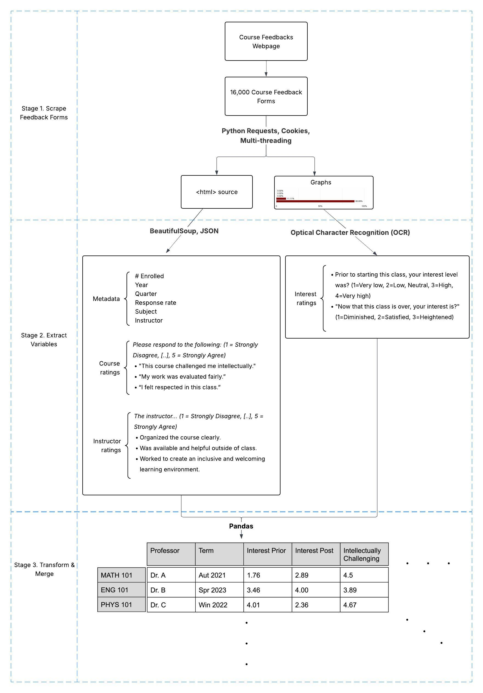

# Course-Evaluations
**Citation**: Zhang, J., Cha, Y. & Oishi, S. _Resolving the Education-Wellbeing Paradox: Education Predicts Psychological Richness but Not Happiness or Meaning_.

The following codes are developed to scrape UChicago's Course Evaluations for Study 1, with approval from IRB Protocol 24-1728 and the University Registrar.

## Data Pipeline

